# Income Sync Flow - Mermaid Sequence Diagram

## Complete Income Sync Flow with RBAC

```mermaid
sequenceDiagram
    participant Client
    participant EnhancedSyncManager as Enhanced Sync Manager
    participant AuthRepository as Auth Repository
    participant IncomeSyncManager as Income Sync Manager
    participant SyncPermissionManager as Sync Permission Manager
    participant IncomeDao as Income DAO
    participant CategoryDao as Category DAO
    participant PersonDao as Person DAO
    participant Firestore
    participant SyncTimestampManager as Timestamp Manager

    Note over Client,SyncTimestampManager: Income Sync Initialization

    Client->>EnhancedSyncManager: syncIncomes()
    
    EnhancedSyncManager->>AuthRepository: getUserRole()
    AuthRepository-->>EnhancedSyncManager: Role (ADMIN/EMPLOYEE)
    
    EnhancedSyncManager->>IncomeSyncManager: uploadLocalIncomes(userId, userRole, targetUserIds?)
    
    Note over IncomeSyncManager,SyncPermissionManager: Permission Validation

    IncomeSyncManager->>SyncPermissionManager: checkSyncPermission(userId, userRole, targetUserIds)
    SyncPermissionManager->>SyncPermissionManager: Validate role permissions
    
    alt User has SYNC_ALL_USERS_DATA (Admin)
        SyncPermissionManager-->>IncomeSyncManager: SyncPermissionResult(canSync=true, isAdminMode=true)
    else User has SYNC_OWN_DATA (Employee)
        SyncPermissionManager-->>IncomeSyncManager: SyncPermissionResult(canSync=true, isAdminMode=false)
    else No permissions
        SyncPermissionManager-->>IncomeSyncManager: SyncPermissionResult(canSync=false)
        IncomeSyncManager-->>EnhancedSyncManager: Return (Permission denied)
        EnhancedSyncManager-->>Client: Error: Permission denied
    end

    Note over IncomeSyncManager,IncomeDao: Determine Users to Sync

    alt Admin Mode AND targetUserIds is null
        IncomeSyncManager->>IncomeDao: getAllUnsyncedUserIds()
        IncomeDao-->>IncomeSyncManager: List<String> (all user IDs with unsynced incomes)
    else Admin Mode AND targetUserIds provided
        Note over IncomeSyncManager: Use provided targetUserIds
    else Regular User Mode
        Note over IncomeSyncManager: Use only authenticatedUserId
    end

    Note over IncomeSyncManager,Firestore: Process Each User

    loop For each target user
        IncomeSyncManager->>IncomeSyncManager: uploadIncomesForUser(targetUserId, authenticatedUserId, userRole)
        
        IncomeSyncManager->>IncomeDao: getUnsyncedIncomes(targetUserId)
        IncomeDao-->>IncomeSyncManager: List<IncomeEntity>
        
        alt No unsynced incomes
            Note over IncomeSyncManager: Log "No incomes to upload" and continue
        else Has unsynced incomes
            IncomeSyncManager->>IncomeSyncManager: validateAndFilterIncomes(incomes, targetUserId, userRole)
            
            loop For each income to validate
                alt income.userId != targetUserId
                    Note over IncomeSyncManager: Log "SKIPPED: userId mismatch" and filter out
                else income.userId == targetUserId
                    Note over IncomeSyncManager: Include in valid incomes list
                end
            end
            
            IncomeSyncManager->>IncomeSyncManager: prepareIncomesForUpload(validIncomes, currentSyncTime)
            
            loop For each valid income
                IncomeSyncManager->>CategoryDao: getCategoryById(income.categoryId)
                CategoryDao-->>IncomeSyncManager: CategoryEntity?
                
                alt Category not found or not synced
                    Note over IncomeSyncManager: Log "SKIPPED: Category not synced" and skip
                else Category found
                    alt income has personId
                        IncomeSyncManager->>PersonDao: getPersonById(income.personId)
                        PersonDao-->>IncomeSyncManager: PersonEntity?
                        
                        alt Person not found or not synced
                            Note over IncomeSyncManager: Log "SKIPPED: Person not synced" and skip
                        else Person found
                            Note over IncomeSyncManager: Continue with person data
                        end
                    end
                    
                    IncomeSyncManager->>IncomeSyncManager: getOrGenerateFirestoreId(income, targetUserId)
                    
                    alt income.firestoreId exists
                        Note over IncomeSyncManager: Use existing firestoreId (UPDATE)
                    else income.firestoreId is null
                        IncomeSyncManager->>Firestore: Generate new document ID
                        Firestore-->>IncomeSyncManager: New document ID (CREATE)
                    end
                    
                    IncomeSyncManager->>IncomeSyncManager: buildIncomeFirestoreData(income, categoryId, personId, docId, syncTime)
                    Note over IncomeSyncManager: Add to PreparedIncomeData list
                end
            end
            
            IncomeSyncManager->>IncomeSyncManager: uploadInBatches(preparedData, currentSyncTime)
            
            loop Batch processing (max 500 operations per batch)
                IncomeSyncManager->>IncomeSyncManager: addIncomeToBatch(batch, preparedData, targetUserId)
                IncomeSyncManager->>Firestore: batch.set(docRef, incomeData)
                
                alt Batch full (500 operations)
                    IncomeSyncManager->>IncomeSyncManager: commitBatchAndUpdateStatus(batch, incomesToUpdate, count, syncTime)
                    IncomeSyncManager->>Firestore: batch.commit()
                    Firestore-->>IncomeSyncManager: Commit successful
                    
                    loop For each income in batch
                        IncomeSyncManager->>IncomeDao: updateSyncStatus(incomeId, firestoreId, isSynced=true, lastSyncedAt)
                        IncomeDao-->>IncomeSyncManager: Status updated
                    end
                    
                    Note over IncomeSyncManager: Create new batch and continue
                end
            end
            
            alt Final batch has operations
                IncomeSyncManager->>Firestore: batch.commit()
                Firestore-->>IncomeSyncManager: Commit successful
                
                loop For each income in final batch
                    IncomeSyncManager->>IncomeDao: updateSyncStatus(incomeId, firestoreId, isSynced=true, lastSyncedAt)
                    IncomeDao-->>IncomeSyncManager: Status updated
                end
            end
        end
    end

    Note over EnhancedSyncManager,Firestore: Download Phase

    EnhancedSyncManager->>IncomeSyncManager: downloadRemoteIncomes(userId, userRole, targetUserIds?, isInitialization)
    
    IncomeSyncManager->>SyncPermissionManager: checkSyncPermission(userId, userRole, targetUserIds)
    SyncPermissionManager-->>IncomeSyncManager: SyncPermissionResult
    
    alt Permission denied
        IncomeSyncManager-->>EnhancedSyncManager: Return (Permission denied)
    else Permission granted
        Note over IncomeSyncManager: Determine users to download (same logic as upload)
        
        loop For each target user
            IncomeSyncManager->>IncomeSyncManager: downloadIncomesForUser(userId, isInitialization)
            
            alt isInitialization
                Note over IncomeSyncManager: lastSyncTime = 0 (download all)
            else Regular sync
                IncomeSyncManager->>SyncTimestampManager: getLastSyncTimestamp(SyncType.INCOMES, userId)
                SyncTimestampManager-->>IncomeSyncManager: lastSyncTime
            end
            
            IncomeSyncManager->>Firestore: Query incomes where updatedAt > lastSyncTime
            Firestore-->>IncomeSyncManager: QuerySnapshot (remote incomes)
            
            loop For each remote income document
                IncomeSyncManager->>IncomeSyncManager: Validate categoryFirestoreId exists
                
                alt categoryFirestoreId missing
                    Note over IncomeSyncManager: Log "SKIPPED: categoryFirestoreId null" and skip
                else categoryFirestoreId present
                    IncomeSyncManager->>CategoryDao: getCategoryByFirestoreId(categoryFirestoreId)
                    CategoryDao-->>IncomeSyncManager: CategoryEntity?
                    
                    alt Category not found locally
                        Note over IncomeSyncManager: Log "SKIPPED: category missing locally" and skip
                    else Category found
                        alt personFirestoreId exists
                            IncomeSyncManager->>PersonDao: getPersonByFirestoreId(personFirestoreId)
                            PersonDao-->>IncomeSyncManager: PersonEntity?
                            
                            alt Person not found locally
                                Note over IncomeSyncManager: Log "SKIPPED: person missing locally" and skip
                            else Person found
                                Note over IncomeSyncManager: Continue with person data
                            end
                        end
                        
                        IncomeSyncManager->>IncomeSyncManager: Convert Firestore document to IncomeEntity
                        IncomeSyncManager->>IncomeDao: getIncomeByLocalId(remoteIncome.localId)
                        IncomeDao-->>IncomeSyncManager: Existing income?
                        
                        alt Income exists locally
                            IncomeSyncManager->>IncomeSyncManager: resolveConflict(existingIncome, remoteIncome)
                            
                            alt local.updatedAt >= remote.updatedAt
                                Note over IncomeSyncManager: Keep local, mark as synced
                            else remote.updatedAt > local.updatedAt
                                Note over IncomeSyncManager: Use remote data, preserve local keys
                            end
                            
                            IncomeSyncManager->>IncomeDao: update(resolvedIncome)
                            IncomeDao-->>IncomeSyncManager: Income updated
                        else New income
                            IncomeSyncManager->>IncomeDao: insert(remoteIncome)
                            IncomeDao-->>IncomeSyncManager: Income inserted
                        end
                        
                        Note over IncomeSyncManager: Track latest timestamp for incremental sync
                    end
                end
            end
            
            alt latestRemoteTimestamp > lastSyncTime
                IncomeSyncManager->>SyncTimestampManager: updateLastSyncTimestamp(SyncType.INCOMES, latestTimestamp)
                SyncTimestampManager-->>IncomeSyncManager: Timestamp updated
            end
        end
    end

    Note over EnhancedSyncManager,SyncTimestampManager: Finalization

    EnhancedSyncManager->>SyncTimestampManager: updateLastSyncTimestamp(SyncType.INCOMES)
    SyncTimestampManager-->>EnhancedSyncManager: Final timestamp updated
    
    EnhancedSyncManager-->>Client: Sync completed successfully

    Note over Client,SyncTimestampManager: Error Handling (if any step fails)
    
    alt Any error occurs
        Note over IncomeSyncManager: Log error details
        IncomeSyncManager-->>EnhancedSyncManager: Throw exception
        EnhancedSyncManager-->>Client: Error: Sync failed with details
    end
```

## Key Flow Decision Points

### 1. Permission Validation
- **ADMIN with SYNC_ALL_USERS_DATA**: Can sync any users
- **EMPLOYEE with SYNC_OWN_DATA**: Can only sync their own data
- **No permissions**: Sync denied

### 2. User Determination Logic
- **Admin + targetUserIds=null**: Sync ALL users with unsynced incomes
- **Admin + targetUserIds=provided**: Sync only specified users
- **Regular user**: Sync only authenticated user's data

### 3. Dependency Resolution
- **Category**: Must exist and be synced before income can be uploaded
- **Person**: If linked, must exist and be synced before income can be uploaded

### 4. Conflict Resolution (Download)
- **Local newer**: Keep local data, mark as synced
- **Remote newer**: Use remote data, preserve local primary keys

### 5. Batch Processing
- **Upload**: Groups operations into batches of 500 for Firestore efficiency
- **Status Update**: Only after successful Firestore commit

## RBAC Security Layers

1. **Permission Check**: Validates role-based permissions
2. **Entity Validation**: Ensures income.userId matches target user
3. **Firestore Path**: Uses entity's actual userId for document path