# Fiscal Compass - Sync System Class Diagram

## Comprehensive Mermaid Class Diagram for Complete Sync System

```mermaid
classDiagram
    %% ========================
    %% CORE SYNC MANAGERS
    %% ========================
    
    class EnhancedSyncManager {
        -ExpenseSyncManager expenseSyncManager
        -IncomeSyncManager incomeSyncManager
        -CategorySyncManager categorySyncManager
        -PersonSyncManager personSyncManager
        -FirebaseAuth auth
        -SyncTimestampManager timestampManager
        -SyncDependencyManager dependencyManager
        -CheckPermissionUseCase checkPermissionUseCase
        +syncAllData()
        +syncExpenses()
        +syncIncomes()
        +syncPersons()
        +syncCategories()
        +initializeCategories(userId: String)
        +initializePersons(userId: String)
        +initializeExpenses(userId: String)
        +initializeIncomes(userId: String)
    }
    
    class EnhancedSyncManagerImpl {
        -EnhancedSyncManager enhancedSyncManager
        +syncAllData()
        +syncCategories()
        +syncPersons()
        +syncExpenses()
        +syncIncomes()
    }
    
    class AutoSyncManager {
        -SyncService syncService
        -TimestampProvider timestampProvider
        -SyncDependencyManager dependencyManager
        -NetworkStateProvider networkStateProvider
        -LocalDataSource localDataSource
        -Preferences preferences
        -AuthService authService
        -CoroutineScope coroutineScope
        -MutableStateFlow~SyncStatus~ _syncStatusFlow
        -Channel~SyncType~ syncChannel
        -Set~SyncType~ syncQueue
        -boolean isSyncing
        +initialize(scope: CoroutineScope)
        +triggerSync(syncType: SyncType)
        -startSyncProcessor()
        -processSyncQueue()
        -scheduleRetry(failedTypes: Set~SyncType~)
        -getRetryDelay(): Long
        -observeNetworkChanges()
        -observeUnsyncedData()
        -updateSyncStatus(update: Function)
        -hasUnsyncedData(): Boolean
    }
    
    %% ========================
    %% ENTITY-SPECIFIC SYNC MANAGERS
    %% ========================
    
    class ExpenseSyncManager {
        -FirebaseFirestore firestore
        -SyncTimestampManager timestampManager
        -ExpenseDao expenseDao
        -CategoryDao categoryDao
        -PersonDao personDao
        +uploadLocalExpenses(userId: String)
        +downloadRemoteExpenses(userId: String, isInitialization: Boolean)
        -resolveConflict(local: ExpenseEntity, remote: ExpenseEntity): ExpenseEntity
    }
    
    class IncomeSyncManager {
        -FirebaseFirestore firestore
        -SyncTimestampManager timestampManager
        -IncomeDao incomeDao
        -CategoryDao categoryDao
        -PersonDao personDao
        +uploadLocalIncomes(userId: String)
        +downloadRemoteIncomes(userId: String, isInitialization: Boolean)
        -resolveConflict(local: IncomeEntity, remote: IncomeEntity): IncomeEntity
    }
    
    class CategorySyncManager {
        -FirebaseFirestore firestore
        -SyncTimestampManager timestampManager
        -CategoryDao categoryDao
        +uploadLocalCategories()
        +downloadRemoteCategories()
        -uploadCategory(category: CategoryEntity, collectionRef: CollectionReference, parentFirestoreId: String, syncTime: Long)
        -processRemoteCategory(categoryData: Map~String, Any~)
    }
    
    class PersonSyncManager {
        -FirebaseFirestore firestore
        -SyncTimestampManager timestampManager
        -PersonDao personDao
        +uploadLocalPersons()
        +downloadRemotePersons()
        -processRemotePerson(personData: Map~String, Any~)
    }
    
    class UserSyncManager {
        -FirebaseFirestore firestore
        -UserDao userDao
        -UserRepository userRepository
        +syncAllUsers(forceRefresh: Boolean): SyncResult
        +syncUser(userId: String): SyncResult
        +getAllLocalUserIds(): List~String~
        +getAllLocalUsers(): List~UserEntity~
        +hasLocalUsers(): Boolean
        +initializeAdminSync(userRole: Role): Boolean
    }
    
    %% ========================
    %% DEPENDENCY & TIMESTAMP MANAGEMENT
    %% ========================
    
    class SyncDependencyManager {
        -PreferenceManager preferences
        -Map~SyncType, SyncDependency~ syncDependencies
        +canSync(syncType: SyncType, userId: String): Boolean
        +isInitialized(syncType: SyncType, userId: String): Boolean
        +markAsInitialized(syncType: SyncType, userId: String)
        +getRequiredInitializationOrder(): List~SyncType~
        +getPendingInitializations(userId: String): List~SyncType~
        +resetInitialization(userId: String)
    }
    
    class SyncTimestampManager {
        -PreferenceManager preferences
        -AppDatabase roomDatabase
        +getLastSyncTimestamp(syncType: SyncType, userId: String): Long
        +getCategoriesLastSyncTimestamp(): Long
        +getPersonsLastSyncTimestamp(): Long
        +updateLastSyncTimestamp(syncType: SyncType, timestamp: Long)
        -getFallbackSyncTimestamp(syncType: SyncType, userId: String): Long
        -getDefaultSyncTimestamp(): Long
        -getOldestUnsyncedExpenseTimestamp(userId: String): Long
        -getOldestUnsyncedIncomeTimestamp(userId: String): Long
        -getOldestUnsyncedPersonTimestamp(userId: String): Long
        -resetAllTimestamps()
    }
    
    %% ========================
    %% PRESENTATION LAYER
    %% ========================
    
    class SyncViewModel {
        -LocalDataSource localDataSource
        -NetworkStateProvider networkDataSource
        -SyncService syncService
        -MutableStateFlow~SyncScreenState~ _state
        -Job unsyncedDataCollectionJob
        +onEvent(event: SyncEvent)
        -checkUnsyncedData()
        -collectUnsyncedCounts()
        -checkConnectivityStatus()
        -updateState(update: Function)
    }
    
    %% ========================
    %% INTERFACES
    %% ========================
    
    class SyncService {
        <<interface>>
        +syncAllData()
        +syncCategories()
        +syncPersons()
        +syncExpenses()
        +syncIncomes()
    }
    
    class LocalDataSource {
        <<interface>>
        +hasUnsyncedData(): Boolean
        +getUnsyncedExpenseCount(): Flow~Int~
        +getUnsyncedIncomeCount(): Flow~Int~
    }
    
    class NetworkStateProvider {
        <<interface>>
        +networkStateFlow: StateFlow~Boolean~
        +isOnline(): Boolean
    }
    
    class TimestampProvider {
        <<interface>>
        +updateLastSyncTimestamp(syncType: SyncType)
        +getLastSyncInfo(): SyncInfo
    }
    
    class AuthService {
        <<interface>>
        +currentUserId: String
    }
    
    class Preferences {
        <<interface>>
        +saveInt(key: String, value: Int)
        +getInt(key: String, defaultValue: Int): Int
    }
    
    class PreferenceManager {
        <<interface>>
        +saveBoolean(key: String, value: Boolean)
        +getBoolean(key: String, defaultValue: Boolean): Boolean
        +saveLong(key: String, value: Long)
        +getLong(key: String, defaultValue: Long): Long
        +saveString(key: String, value: String)
        +getString(key: String, defaultValue: String): String
        +remove(key: String)
    }
    
    class UserRepository {
        <<interface>>
        +getUser(userId: String): UserEntity
        +getAllUsers(): List~UserEntity~
    }
    
    class AuthRepository {
        <<interface>>
        +getUserRole(): Role
        +getCurrentUser(): UserEntity
    }
    
    %% ========================
    %% USE CASES
    %% ========================
    
    class CheckPermissionUseCase {
        -AuthRepository authRepository
        +invoke(permission: Permission): Boolean
    }
    
    %% ========================
    %% DATA CLASSES & ENUMS
    %% ========================
    
    class SyncType {
        <<enumeration>>
        EXPENSES
        INCOMES
        CATEGORIES
        PERSONS
        USERS
        ALL
    }
    
    class SyncPriority {
        <<enumeration>>
        CRITICAL(0)
        DEPENDENT(1)
        OPTIONAL(2)
        +level: Int
    }
    
    class SyncStatus {
        +isOnline: Boolean
        +isSyncing: Boolean
        +pendingCategories: Int
        +pendingExpenses: Int
        +pendingIncomes: Int
        +lastSyncTime: Long
        +syncError: String
    }
    
    class SyncDependency {
        +type: SyncType
        +priority: SyncPriority
        +dependencies: List~SyncType~
    }
    
    class SyncInfo {
        +lastFullSync: Long
        +lastExpenseSync: Long
        +lastIncomeSync: Long
    }
    
    class SyncScreenState {
        +isLoading: Boolean
        +error: String
        +hasUnsyncedData: Boolean
        +unsyncedExpenseCount: Int
        +unsyncedIncomeCount: Int
        +isConnected: StateFlow~Boolean~
        +isSyncing: Boolean
    }
    
    class SyncEvent {
        <<sealed>>
    }
    
    class SyncAll {
        <<SyncEvent>>
    }
    
    class CancelSync {
        <<SyncEvent>>
    }
    
    class SyncResult {
        <<sealed>>
    }
    
    class SyncResultSuccess {
        <<SyncResult>>
        +users: List~UserEntity~
    }
    
    class SyncResultError {
        <<SyncResult>>
        +message: String
    }
    
    %% ========================
    %% EXTERNAL DEPENDENCIES
    %% ========================
    
    class FirebaseFirestore {
        <<external>>
        +collection(path: String): CollectionReference
        +batch(): WriteBatch
    }
    
    class FirebaseAuth {
        <<external>>
        +currentUser: FirebaseUser
    }
    
    %% ========================
    %% RELATIONSHIPS
    %% ========================
    
    %% Implementation relationships
    EnhancedSyncManagerImpl ..|> SyncService : implements
    
    %% Composition relationships - Core Sync Managers
    EnhancedSyncManager o-- ExpenseSyncManager : uses
    EnhancedSyncManager o-- IncomeSyncManager : uses
    EnhancedSyncManager o-- CategorySyncManager : uses
    EnhancedSyncManager o-- PersonSyncManager : uses
    EnhancedSyncManager o-- SyncTimestampManager : uses
    EnhancedSyncManager o-- SyncDependencyManager : uses
    EnhancedSyncManager o-- CheckPermissionUseCase : uses
    EnhancedSyncManager o-- FirebaseAuth : uses
    
    EnhancedSyncManagerImpl o-- EnhancedSyncManager : delegates to
    
    %% AutoSyncManager relationships
    AutoSyncManager o-- SyncService : uses
    AutoSyncManager o-- TimestampProvider : uses
    AutoSyncManager o-- SyncDependencyManager : uses
    AutoSyncManager o-- NetworkStateProvider : uses
    AutoSyncManager o-- LocalDataSource : uses
    AutoSyncManager o-- Preferences : uses
    AutoSyncManager o-- AuthService : uses
    AutoSyncManager ..> SyncStatus : creates
    AutoSyncManager ..> SyncType : uses
    
    %% Entity-specific sync managers relationships
    ExpenseSyncManager o-- FirebaseFirestore : uses
    ExpenseSyncManager o-- SyncTimestampManager : uses
    ExpenseSyncManager ..> SyncType : uses
    
    IncomeSyncManager o-- FirebaseFirestore : uses
    IncomeSyncManager o-- SyncTimestampManager : uses
    IncomeSyncManager ..> SyncType : uses
    
    CategorySyncManager o-- FirebaseFirestore : uses
    CategorySyncManager o-- SyncTimestampManager : uses
    CategorySyncManager ..> SyncType : uses
    
    PersonSyncManager o-- FirebaseFirestore : uses
    PersonSyncManager o-- SyncTimestampManager : uses
    PersonSyncManager ..> SyncType : uses
    
    UserSyncManager o-- FirebaseFirestore : uses
    UserSyncManager o-- UserRepository : uses
    UserSyncManager ..> SyncResult : returns
    
    %% Dependency & Timestamp Management relationships
    SyncDependencyManager o-- PreferenceManager : uses
    SyncDependencyManager ..> SyncDependency : manages
    SyncDependencyManager ..> SyncType : uses
    SyncDependencyManager ..> SyncPriority : uses
    
    SyncTimestampManager o-- PreferenceManager : uses
    SyncTimestampManager ..> SyncType : uses
    SyncTimestampManager ..> SyncInfo : returns
    
    SyncDependency o-- SyncType : contains
    SyncDependency o-- SyncPriority : has
    
    %% Presentation layer relationships
    SyncViewModel o-- LocalDataSource : uses
    SyncViewModel o-- NetworkStateProvider : uses
    SyncViewModel o-- SyncService : uses
    SyncViewModel ..> SyncScreenState : manages
    SyncViewModel ..> SyncEvent : handles
    
    %% Use Case relationships
    CheckPermissionUseCase o-- AuthRepository : uses
    
    %% Event hierarchy
    SyncEvent <|-- SyncAll : extends
    SyncEvent <|-- CancelSync : extends
    
    %% Result hierarchy
    SyncResult <|-- SyncResultSuccess : extends
    SyncResult <|-- SyncResultError : extends

```



## System Architecture Overview

### Core Components

1. **EnhancedSyncManager**: Main orchestrator that coordinates all sync operations
2. **AutoSyncManager**: Handles automatic synchronization with retry logic and network awareness
3. **Entity-Specific Sync Managers**: Handle upload/download for specific entities (Expense, Income, Category, Person, User)
4. **SyncDependencyManager**: Manages initialization dependencies between sync operations
5. **SyncTimestampManager**: Tracks last sync timestamps for incremental sync

### Sync Flow

```
User Action → SyncViewModel → EnhancedSyncManager → Entity Sync Managers → Firebase/Local DB
                    ↓
              AutoSyncManager (monitors & auto-triggers)
                    ↓
         SyncDependencyManager (validates dependencies)
                    ↓
         SyncTimestampManager (tracks sync times)
```

### Key Features

- **RBAC Integration**: Permission checks before sync operations
- **Dependency Management**: Ensures categories/persons sync before expenses/incomes
- **Conflict Resolution**: Handles concurrent modifications
- **Incremental Sync**: Only syncs data changed since last sync
- **Batch Operations**: Uses Firestore batch writes for efficiency
- **Retry Logic**: Exponential backoff for failed syncs
- **Network Awareness**: Auto-sync when network becomes available

### Sync Priority Levels

1. **CRITICAL (0)**: Categories, Persons (must sync first)
2. **DEPENDENT (1)**: Expenses, Incomes (depend on critical data)
3. **OPTIONAL (2)**: User profile updates

